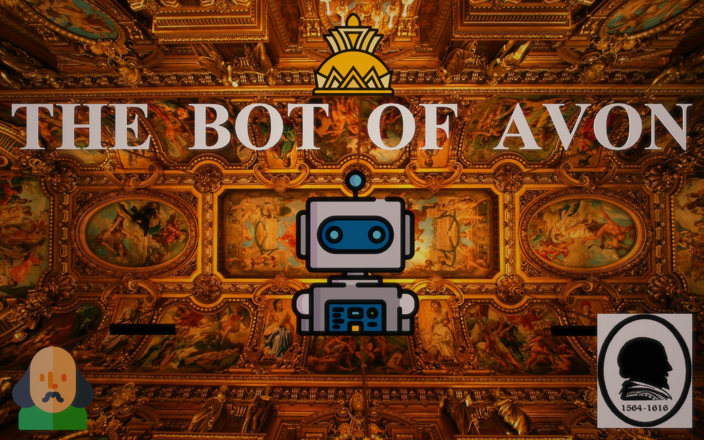

# The-Bot-of-Avon
A Discord Bot enthusiastic about theater arts and the works of Shakespeare.

The Bot of Avon is inspired by William Shakespeare, who was also known as the Bard of Avon. We decided to build a project that could enable people to enjoy classic theater plays even in modern times and also learn more about the exemplary works of Shakespeare.

# What It Does
**The Bot of Avon** can be used to obtain information about Shakespeare's works. It can also be tasked with performing a theater play, whereby it sequentially traverses through each and every dialogue/act in the entire play, giving the server members a feel of witnessing a live play.

The set of commands currently supported by the bot include:

1) **!play {Name of the play to be performed}**- start performing a particular theater play.

2) **!info {Name of the poem/play}** - obtain information about a particular work of Shakespeare.

3) **!find '{line}'** - find information about a line - the character who spoke the line and in which play.

4) **!help** - displays the set of commands and their usage.

# How We Built It
The Bot of Avon was built using Node.js with the discord.js library - to access the Discord API. We made use of Cockroachdb to manage the bot's database, along with Sequelize. This was the very first time we were using Cockroachdb. The dialogues for all the theater plays were obtained from a dataset we had found on Kaggle.

# Challenges We Ran Into
We surely had to face some amount of hurdles along the way. Most of us had little to no experience with Discord Bots and the discord.js library. But thanks to the extremely helpful docs, we were able to pull it off. Async await and handling promises in javascript also resulted in some trouble for us and we had to spent some significant amount of time and effort to resolve the issue.

# Accomplishments That We're Proud Of
We take pride in having been able to build a project that seeks to enlighten people more about theater plays and literature and which is also a tribute to Shakespeare. We are also proud of having been able to set up and use Cockroachdb just as we required even though this was our first time.

# What We Learned
We were able to learn and try out Cockroachdb successfully. We also enhanced our knowledge about JavaScript, Node.js and also got to learn a lot about the discord.js library.

# What's Next For Producti-Bot
We're planning to provide enhanced features like voice-based dialogues as well during the plays so that it could be more engaging for the users. We're also planning to expand the bot's collection of theater plays and include non-Shakesperian plays in the database as well.

© 2021 **The Bot Of Avon Team**. All rights reserved.
